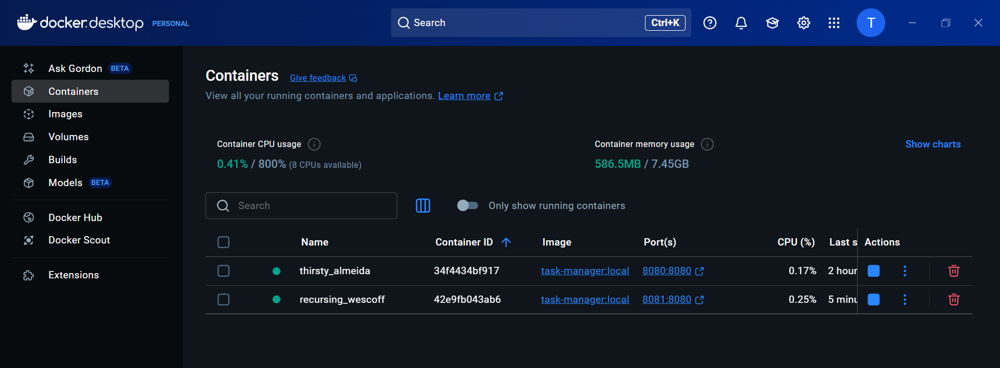

# Midterm Practical CI Pipeline - Task Manager App

This is a Java Spring Boot **Task Manager App** created for the Midterm Practical assignment: Designing & Implementing a CI Pipeline with GitHub Actions.

---

## Project Overview

This app is a Task Manager with a web UI, built using:

- Java 17
- Spring Boot 3.x
- Thymeleaf for the front-end
- H2 In-Memory Database
- Maven build tool
- Docker

It allows adding and deleting tasks, with two environments: **DEV** and **PROD** (multi-environment deployment).

---

## Why This Project?

- Provides both API logic and front-end UI.
- Is precise and self-contained (easy to test).
- Suitable for CI pipeline demonstration.

---

## Branching

- `develop` → auto-deploy DEV env  
- `main` → manual deploy to PROD env

---

## CI Pipeline — Stages and Purpose

The CI pipeline is defined in `.github/workflows/ci.yml`.

### 1. **Build Stage** 

- `mvn clean install`  
- Ensures the app builds correctly.
- Fails the pipeline if build errors occur.
- Verifies dependencies, compiles Java classes.

### 2. **Test Stage** 

- `mvn test`  
- 4 unit tests included.
- Verifies application correctness.
- Fails pipeline if any test fails.

### 3. **Static Analysis** 

- `mvn spotbugs:check`  
- SpotBugs is used as the static analyzer.
- Catches potential bugs (null pointer, resource leaks, etc).
- Fails pipeline if critical issues detected.

### 4. How to Run Locally (without Docker)

If you want to run the app locally using Maven and Java:

### 1️ Prerequisites (Install First)

- Java 17 JDK (tested with Temurin or Corretto)
- Maven 3.x
- Git
- Any IDE (VSCode or IntelliJ IDEA)
- Add JDK and Maven bin paths to system environment variables under System Path.

For VSCode also install extensions:
- Java Extension Pack
- Maven for Java

---

### 2️ Clone the Repository

```bash
git clone https://github.com/TwinkleM97/Midterm-Practical-CI.git
cd Midterm-Practical-CI
```

---

### 3️ Build the project (skip SpotBugs during local install)

```powershell
mvn clean install "-Dspotbugs.skip=true"
```

---

### 4️ Run the app (DEV)

```powershell
mvn spring-boot:run "-Dspring-boot.run.profiles=dev"
```

App will run at: [http://localhost:8080](http://localhost:8080)

---

### 5️ Run the app (PROD)

```powershell
mvn spring-boot:run "-Dspring-boot.run.profiles=prod"
```

App will run at: [http://localhost:8080](http://localhost:8080)

---

### Notes

On Windows with Docker Desktop, if you see:

```bash
exec /usr/bin/sh: accessing a corrupted shared library
```

This is a known issue with the Temurin JDK base image in WSL2 + Docker Desktop.  
**Workaround:** run the app using Maven directly, as shown above.

SpotBugs is included in CI pipeline but can be skipped in local builds to prevent slowdowns.


### **Docker Image Build & Upload** 

- Builds Docker image:  
  `docker build -t task-manager:commitsha .`
- Uploads to **DockerHub**:  
  `docker push twinklem97/task-manager-ci:dev` or `latest`

- **Purpose**:  
  Provides a deployable artifact (Docker image) and not just source code.

### 5. **Multi-Environment Deployment**

#### Environments:

- `develop` → triggers auto deployment of `dev` image/tag.
- `main` → triggers manual deploy of `prod` image/tag.

#### .env Files:

- `.env.dev` → contains: `APP_TITLE=Task Manager (DEV)`
- `.env.prod` → contains: `APP_TITLE=Task Manager (PROD)`

These environment variables are injected during Docker run to display DEV or PROD label in app.
I used branch-based deployments and .env files to implement multi-environment deployment.

---

## How to Run the App (Docker)

### Step 1: Clone the Repository

```bash
git clone https://github.com/TwinkleM97/Midterm-Practical-CI.git
cd Midterm-Practical-CI
```

---

### Step 2: Build Docker Image

```bash
docker build -t task-manager:local .
```

---

### Step 3: Run in DEV Environment

```bash
docker run --env-file .env.dev -p 8080:8080 task-manager:local
```

Visit: http://localhost:8080

---

### Step 4: Run in PROD Environment

```bash
docker run --env-file .env.prod -p 8081:8080 task-manager:local
```

Visit: http://localhost:8081

---

## CI/CD — Triggering Builds

| Branch     | Trigger Type        | Result / Tag |
|------------|---------------------|--------------|
| develop    | auto on push        | deploys `dev` image |
| main       | manual dispatch     | deploys `latest` (prod) image |

---

## Project Setup & Dependencies

**Dependencies:**

- Spring Boot Web
- Thymeleaf
- Spring Data JPA
- H2 DB
- Spring Boot Test
- SpotBugs Maven Plugin

---

## How to Run CI Manually

Go to GitHub Actions → select **workflow_dispatch** → choose branch → Run workflow.

---

## Why These Choices?

- **SpotBugs**: required static analysis stage.
- **Maven**: build tool to manage dependencies and lifecycle.
- **Docker**: creates deployable, platform-independent artifact.
- **Multi-env**: for `dev` and `prod` — proven via APP_TITLE and separate env files.

---
## Screenshots

The following screenshots are provided in the screenshots folder

### GitHub Actions - DEV Build & Deploy

 
 

### GitHub Actions - Manual PROD Deploy

 

### Git Branches (develop / main)

 

### Static Analysis - SpotBugs Passed

 

### Unit Tests Passed

 

### Docker Run (DEV + PROD)

 

### App running in Browser - DEV

 

### App running in Browser - PROD

 

### DockerHub - Uploaded Images

 

---

## Author
- Twinkle Mishra -8894858

